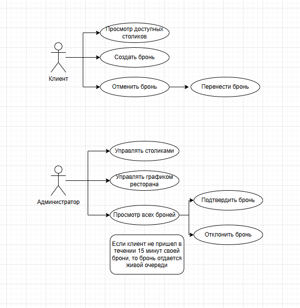
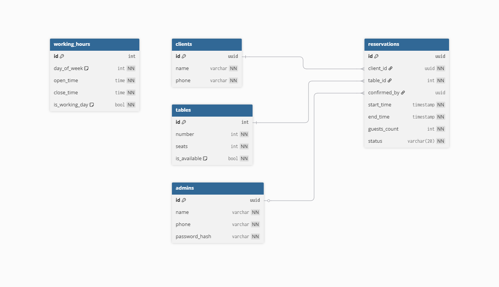

++# Система бронирования столиков ресторана

**Курсовая работа по дисциплине:** Технологии программирования

**Выполнила:** студент группы 210 Кадетова А.С.

---

## О проекте

Бэкенд-приложение для управления бронированием столиков в ресторане.

Система поддерживает два типа пользователей:

**Клиент** может:
- Просматривать доступные столики
- Создать бронь
- Отменить или перенести бронь

**Администратор** может:
- Управлять столиками
- Управлять графиком работы ресторана
- Просматривать все брони, подтверждать или отклонять их
- Если клиент не пришёл в течение 15 минут — бронь отдаётся в живую очередь

---

## Диаграмма вариантов использования (Use Case)

---

## ER-диаграмма базы данных

### Таблицы

| Таблица | Описание |
|---|---|
| `clients` | Клиенты (id, name, phone) |
| `admins` | Администраторы (id, name, phone, password_hash) |
| `tables` | Столики (id, number, seats, is_available) |
| `reservations` | Брони (id, client_id, table_id, confirmed_by, start_time, end_time, guests_count, status) |
| `working_hours` | График работы (id, day_of_week, open_time, close_time, is_working_day) |

---
